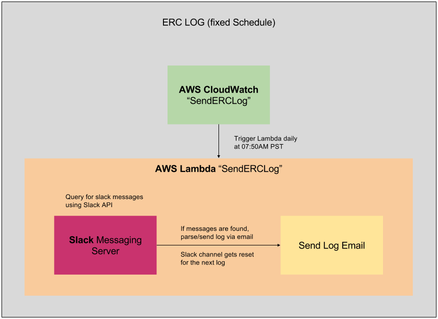
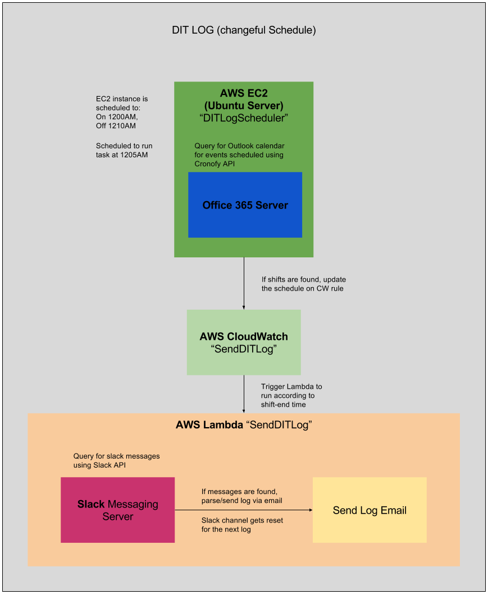

# Log-Generator

<p>
    For work logs, each task completed is sent as a message within a private slack channel. Using the SlackAPI module for python, scripts parse slack messages into a work log that is sent through an email. Emails are sent using the SMTP, EMAIL modules for python. Scripts are run from AWS Lambda, triggered by a CloudWatch event scheduled to run daily.
<br>
<br>
    The DIT script also includes functionality for querying events from a Microsoft Outlook calendar. Scheduling for this log changes daily. The script checks Outlook calnedra for a work shift. If a work shift is found for a given day, a CloudWatch event gets scheduled to trigger the Lambda function.
</p>
<ul>
    <li>ERC LOG: Scheduled to run at a fixed rate, as configured on AWS CloudWatch.</li>
    <li>DIT LOG: CloudWatch event triggers are scheduled according to Microsoft Outlook calendar events.</li>
</ul>




<!-- ## Getting Started

These instructions will get you a copy of the project up and running on your local machine for development and testing purposes. See deployment for notes on how to deploy the project on a live system.

Project should be run using a 64-bit system.

### Prerequisites

You must have the following installed, before you can run an instance of the project.
This guide assumes you already have GIT installed on your computer.

<b>Install Node.JS</b>
```
https://nodejs.org/
```
<b>Install Python 3</b>
```
https://www.python.org/downloads
``` -->

<!-- ### Installing

How to get a development env running. The following instructions can also be used for deployment on a production server. Deployment for a production server would require further configurations, prior to the steps below.

<b>Create a local directory that will house the project.</b>
```
md "c:\source\Path\To\Project\Folder"
```
<b>Initailize an empty local repo</b>
```
git init
```
<b>Clone the latest commit on GitHub</b>
```
git clone "https://github.com/MednickLab/mednickDB.git"
```
<b>Set server folder as CWD</b>
```
cd "ProjectRoot\server"
```
<b>Install Node project dependencies using NPM</b>
```
npm install
```
<b>Set client folder as CWD</b>
```
cd "..\client"
```
<b>Install Angular.JS client dependencies using NPM (Optional)</b>
```
npm install
```
<b>Install grunt task manager globally (Optional)</b>
```
npm install -g grunt-cli
```
<b>Run Node.JS server</b>
```
cd "..\server"
npm start
```
<b>Run Angular.JS client (Optional)</b>
```
cd "..\client"
grunt serve
```

You're application is now running on localhost! For information regarding use and supported API calls, please see the <a href="https://mednicklab.github.io/mednickDB/">documentation</a> at https://mednicklab.github.io/mednickDB/. -->

## Running on AWS, Locally
NOTE: There are two main functions declared in each script. The top function is named "lambda_handler. The second is named "main", with the accompanying "if __name__=='__main__'".
<br><br>
If scripts are to be run using Amazon Web Services, comment out the "main" function and the accompanying "if __name__=='__main__'". The "lambda_handler" should not be commented out.
<br><br>
If scripts are to be run on a local machine, comment out the "lambda_handler" function. The "main" function and the accompanying "if __name__=='__main__' should not be commented out."

<!-- ### Using Curl

Currently, no authentication is required.
Exmaple call (your may have a different port number)
```
curl http://localhost:8000/getStudies
```
Should return a json object with seevral study names. -->

<!-- ## Deployment

Deployment docs will be provided for Ubuntu Server 16.04 LTS. -->

## Built With
* [Python 3](https://www.python.org/downloads/) - High-level programming language for general-purpose programming.
* [Slack API package](http://slackapi.github.io/python-slackclient/) - Slack Developer Kit for Python.
* [Cronofy API](https://www.cronofy.com/) - provides a unified calendar API to allow application developers to integrate their apps.
* [Python Email](https://docs.python.org/2/library/email.html) - An email and MIME handling package.

## Authors
* **Juan Antonio** -- [jvillagomez](https://github.com/jvillagomez)


## License

This project is licensed under the MIT License - see the [LICENSE.md](LICENSE.md) file for details

<!-- ## Acknowledgments

* Stack Overflow
* No seriously, Stack Overflow -->
